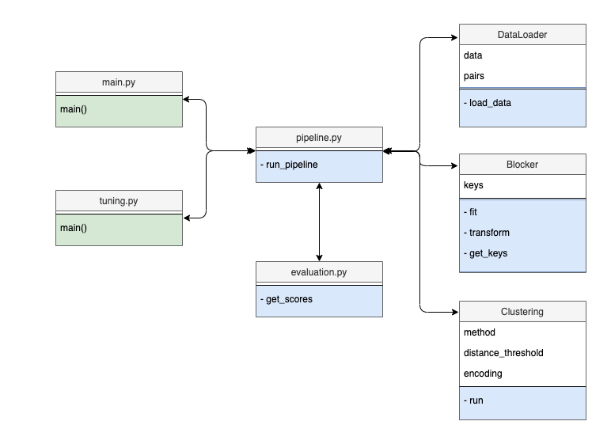

## Project 1: Sigmod contest 2021
> Team members: Akash DHASADE, Angelika ROMANOU, Vinitra SWAMY, Eleni ZAPRIDOU  
Task: [Entity Matching](https://dbgroup.ing.unimo.it/sigmod21contest/task.shtml)

### Project Overview
This project refers to the SIGMOD programming contest 2021.
The task consists of identifying which instances, described by properties (i.e., attributes), represent the same real-world entity (entity resolution).
Participants are asked to solve the task among several datasets of different types (e.g., products, people, etc.). 
Each dataset is made of a list of instances (rows) and a list of properties describing them (columns).
The goal is to find, for each Xi dataset, all pairs of instances that match (i.e., refer to the same real-world entity).  
For more details, read the official SIGMOD 2021 [task description](https://dbgroup.ing.unimo.it/sigmod21contest/task.shtml).

### Methodology
In the following section,the detailed methodology is described. 
The implemented pipeline is comprised of two main parts; the blocking and the entity clustering. 
Blocking tries to minimize the number of comparisons by assigning rows to blocks from the input data based on a specific blocking key scheme.
Entity clustering examines the rows in each block and distills the entity-matching clusters.

#### Blocking
In this step the input dataset is broken down to a set of blocks which groups together similar entities. 
For this problem, the blocking keys were generated based on CPU, RAM, and brand attributes.


#### Clustering
In this step, entity matching is implemented, where for each block collection and for each pair of candidate matches that co-occur in a block, it is decided if they refer to the same entity.
In our implementation we tested two types of approaches (five methods); two **distance similarity methods** and three **unsupervised learning methods**.  

We computed the similarity metrics based on the matched entities that correspond to the blocking key, namely:
- *Jaccard similarity* of each row to its corresponding blocking key group
- *Cosine similarity* of the encoded titles of each row to its corresponding blocking key group
  
We also distill the blocking key groups into smaller matching clusters using the following clustering algorithms
   - *K-Means*
   - *Agglomerative Clustering*
   - *Birch*
 
We also experimented with Mean-Shift clustering and using a BERT based sentence encoder, but found both inferior to the other clustering and encoding approaches. 

### Experiments & Results
We tested all the aforementioned approaches in all the provided datasets. The results for the best model of each type are presented in the following table.

| Model                  | Precision | Recall | F1-score |
|------------------------|:---------:|:------:|:--------:|
| Jaccard similarity (threshold: )  | 0.79      | 0.68   | 0.72     |
| K-means clustering (k: ) with USE embeddings  | 0.80      | 0.69   | 0.72     |
| Cosine similarity (threshold: ) with USE embeddings  | 0.80      | 0.69   | 0.72     |
| Birch clustering with USE embeddings  | 0.80      | 0.69   | 0.72     |
| Agglomerative Clustering (dist = 2) with USE embeddings  | 0.80      | 0.69   | **0.678**     |
 
 
After tuning our hyper-parameters, our optimal pipeline involves:
- Encoder: **Universal Sentence Encoder** (USE)
- Clustering method: **Agglomerative clustering** (distance threshold = 2)
- F1 score on leaderboard: **0.678**
- On 14.04.2021, our team "sigmodest" was 5th place in the rankings.

> [Leaderboard](https://dbgroup.ing.unimo.it/sigmod21contest/leaders.shtml)


### Code structure
The code is implemented in a modular and configurable fashion so as to decouple main logic with the orchestration and the hyper-parameter tuning. 

Main components of the application are:
- ```data_loader.p``` : Loads a dataset given its name. 
- ```blocking.py``` : Performs the blocking functionality as described in section [Blocking](#blocking).
- ```clustering.py``` : Performs the clustering functionality as described in section [Clustering](#clustering).
- ```evaluation.py``` : Compares predicted pairs with the actual ones and returns classification scores (precision, recall, f1-score).
- ```pipeline.py``` : Performs the main logic of the app. It brings together the data with the blocking, the clustering and the evaluation. 
- ```tuning.py``` :  For a set of hyper-parameters for blocking and clustering method, it runs the pipeline and stores evaluation scores.
- ```main.py``` :  It runs the submitted pipeline, it creates and stores the output.csv file.



### Deployment

Please follow the instruction below to run the app.

Create `virtualenv` and install requirements.
```bash
pip install virtualenv
virtualenv <name_of_virtualenv>
source <name_of_virtualenv>/bin/activate
pip install -r requirements.txt
```

Run tuning (for all encoding + similarity + clustering combinations and resulting evaluations)
```bash
python src/tuning.py
```

Run main (for the optimal encoding + similarity + clustering combination from the leaderboard results).
```bash
python src/main.py
```
